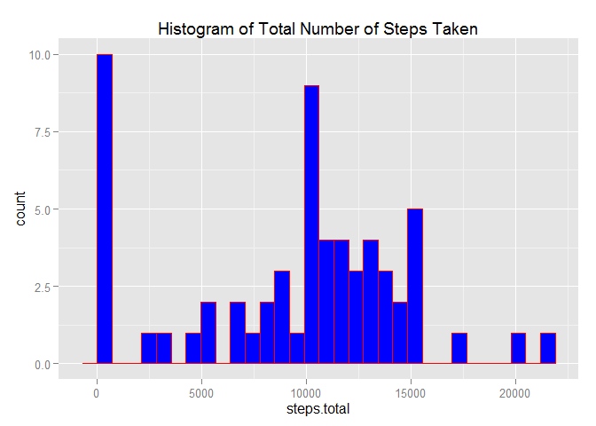

# Reproducible Research: Peer Assessment 1

```
## Loading required package: ggplot2
```

```
## Warning: package 'ggplot2' was built under R version 3.1.3
```

```
## Loading required package: lattice
```

```
## Warning: package 'lattice' was built under R version 3.1.3
```

## Loading and preprocessing the data
In this segment, the data is first loaded and then date column is changed to a date data type. 
First few rows of data are shown as a sample.

```r
activity <- read.csv(file="activity.csv", header = TRUE)
activity$date<-as.Date(activity$date, format = "%Y-%m-%d")
head(activity)
```

```
##   steps       date interval
## 1    NA 2012-10-01        0
## 2    NA 2012-10-01        5
## 3    NA 2012-10-01       10
## 4    NA 2012-10-01       15
## 5    NA 2012-10-01       20
## 6    NA 2012-10-01       25
```


## What is mean total number of steps taken per day?
The total number of steps taken per day are calculated in the following manner and the first few rows are shown as a sample.

```r
steps.total<-sapply(split(activity$steps,activity$date),sum,na.rm=TRUE)
totalStepsTable<-data.frame(date=unique(activity$date),steps.total = steps.total)
rownames(totalStepsTable)<-NULL
head(totalStepsTable)
```

```
##         date steps.total
## 1 2012-10-01           0
## 2 2012-10-02         126
## 3 2012-10-03       11352
## 4 2012-10-04       12116
## 5 2012-10-05       13294
## 6 2012-10-06       15420
```
Here is a histogram plot of the total number of steps taken each day.

```r
qplot(steps.total,data=totalStepsTable, geom="histogram", main="Histogram of Total Number of Steps Taken", 
      fill=I("blue"), col=I("red"),)
```

```
## stat_bin: binwidth defaulted to range/30. Use 'binwidth = x' to adjust this.
```

 

Here is a summary of the total number of steps taken per day.

```r
summary(totalStepsTable)
```

```
##       date             steps.total   
##  Min.   :2012-10-01   Min.   :    0  
##  1st Qu.:2012-10-16   1st Qu.: 6778  
##  Median :2012-10-31   Median :10395  
##  Mean   :2012-10-31   Mean   : 9354  
##  3rd Qu.:2012-11-15   3rd Qu.:12811  
##  Max.   :2012-11-30   Max.   :21194
```
As can be seen from the table summary above the mean and median of the total number of steps taken per day are 9354 and 10395 respectively.

## What is the average daily activity pattern?
A time series plot of the 5-minute interval to the average number of steps taken across all days is shown as follows:

```r
steps.mean<-sapply(split(activity$steps,activity$interval),mean,na.rm=TRUE)
dailyActivityTable<-data.frame(interval=unique(activity$interval),steps.average = round(steps.mean))
rownames(dailyActivityTable)<-NULL
summary(dailyActivityTable)
```

```
##     interval      steps.average   
##  Min.   :   0.0   Min.   :  0.00  
##  1st Qu.: 588.8   1st Qu.:  2.75  
##  Median :1177.5   Median : 34.50  
##  Mean   :1177.5   Mean   : 37.37  
##  3rd Qu.:1766.2   3rd Qu.: 53.00  
##  Max.   :2355.0   Max.   :206.00
```

```r
qplot(interval,steps.average,data=dailyActivityTable,geom="line",main="Time Series Plot of Average Daily Activity Pattern", col=I("blue"))
```

 

The maximum number of steps taken on average across all the days in the dataset is on 835 minute interval.


## Imputing missing values

```r
missingRows<-subset(activity,is.na(activity$steps))
```
The total number of missing value in the dataset are 2304.
As a strategy, I have used the mean of the 5-minute interval to replace the missing values in the dataset. The first few rows are shown as a sample.

```r
activityFilled<-activity
for(idx in which(is.na(activity$steps))){
    activityFilled[idx,1]<-dailyActivityTable[dailyActivityTable$interval == activityFilled[idx,3],2]
}
head(activityFilled)
```

```
##   steps       date interval
## 1     2 2012-10-01        0
## 2     0 2012-10-01        5
## 3     0 2012-10-01       10
## 4     0 2012-10-01       15
## 5     0 2012-10-01       20
## 6     2 2012-10-01       25
```
Here is the summary of the new dataset with the missing data filled in.

```r
summary(activityFilled)
```

```
##      steps             date               interval     
##  Min.   :  0.00   Min.   :2012-10-01   Min.   :   0.0  
##  1st Qu.:  0.00   1st Qu.:2012-10-16   1st Qu.: 588.8  
##  Median :  0.00   Median :2012-10-31   Median :1177.5  
##  Mean   : 37.38   Mean   :2012-10-31   Mean   :1177.5  
##  3rd Qu.: 27.00   3rd Qu.:2012-11-15   3rd Qu.:1766.2  
##  Max.   :806.00   Max.   :2012-11-30   Max.   :2355.0
```
Here is a histogram plot of the total number of steps taken each day for the new dataset.

```r
steps.total<-sapply(split(activityFilled$steps,activityFilled$date),sum,na.rm=TRUE)
filledStepsTable<-data.frame(date=unique(activityFilled$date),steps.total = steps.total)
rownames(filledStepsTable)<-NULL
qplot(steps.total,data=filledStepsTable, geom="histogram", main="Histogram of Total Number of Steps Taken", 
      fill=I("blue"), col=I("red"),)
```

```
## stat_bin: binwidth defaulted to range/30. Use 'binwidth = x' to adjust this.
```

 

Here is a summary of the total number of steps taken per day for the new dataset.

```r
summary(filledStepsTable)
```

```
##       date             steps.total   
##  Min.   :2012-10-01   Min.   :   41  
##  1st Qu.:2012-10-16   1st Qu.: 9819  
##  Median :2012-10-31   Median :10762  
##  Mean   :2012-10-31   Mean   :10766  
##  3rd Qu.:2012-11-15   3rd Qu.:12811  
##  Max.   :2012-11-30   Max.   :21194
```
As can be seen from the table summary above the mean and median of the total number of steps taken per day are 10765 and 10762 respectively.
Comparing the mean and media values of the new dataset with missing values filled in with the original dataset, it can be infered that the mean and median values are higher in the new dataset. It can also be noticed that filling the missing values resulted in making the mean value to be closer to the median.

## Are there differences in activity patterns between weekdays and weekends?
First, a new factor variable in the dataset with the two levels-"weekday" and "weekend" is added to the dataset and first few row are shown below as a sample.

```r
weekdaycheck<-weekdays(activity$date) %in% c("Saturday","Sunday")
activityDayType<-cbind(activity,day.type=factor(weekdaycheck,levels=c(TRUE,FALSE), labels = c("weekend","weekday")))
head(activityDayType)
```

```
##   steps       date interval day.type
## 1    NA 2012-10-01        0  weekday
## 2    NA 2012-10-01        5  weekday
## 3    NA 2012-10-01       10  weekday
## 4    NA 2012-10-01       15  weekday
## 5    NA 2012-10-01       20  weekday
## 6    NA 2012-10-01       25  weekday
```
Next, the average number of steps taken for each 5-minute interval for both weekdays and weekends is calculated. The first few rows of resulting table along with its summary are shown below. 

```r
activityDayType<-activityDayType[order(activityDayType$day.type),]
activityMean<-sapply(split(activityDayType,activityDayType$day.type),function(x){ sapply(split(x$steps,x$interval),mean,na.rm=TRUE)})
activityMean<-data.frame(activityMean)
activityMean<-cbind(interval=as.integer(rownames(activityMean)),activityMean)
activityMean$weekday<-round(activityMean$weekday)
activityMean$weekend<-round(activityMean$weekend)
rownames(activityMean)<-NULL
head(activityMean)
```

```
##   interval weekend weekday
## 1        0       0       2
## 2        5       0       0
## 3       10       0       0
## 4       15       0       0
## 5       20       0       0
## 6       25       4       2
```

```r
summary(activityMean)
```

```
##     interval         weekend          weekday      
##  Min.   :   0.0   Min.   :  0.00   Min.   :  0.00  
##  1st Qu.: 588.8   1st Qu.:  1.00   1st Qu.:  2.00  
##  Median :1177.5   Median : 32.00   Median : 24.00  
##  Mean   :1177.5   Mean   : 43.08   Mean   : 35.33  
##  3rd Qu.:1766.2   3rd Qu.: 75.25   3rd Qu.: 52.00  
##  Max.   :2355.0   Max.   :175.00   Max.   :234.00
```
Now, a panel plot containing the time serier plot of the 5-minute interval to the average number of steps taken for both weekdays and weekends is shown below. Initially, I've created a new table from the table above to suit for drawing a panel plot and then plot is created based on this new table.

```r
dayTypeMean<-data.frame(interval=rep(activityMean$interval,2),steps.mean=c(activityMean$weekend,activityMean$weekday))
num<-nrow(activityMean)
day.type<-factor(c(rep(TRUE,num),rep(FALSE,num)),levels=c(TRUE,FALSE),labels=c("weekend","weekday"))
dayTypeMean<-cbind(dayTypeMean,day.type)
xyplot(steps.mean ~ interval | day.type, data = dayTypeMean, type = 'l', col="blue", layout = c(1,2))
```

 

As seen from the panel plot above, there are fewer number of steps taken on average on weekends than weekdays from around the 1000th minute interval onwards which shows lesser activity patterns on weekends.
